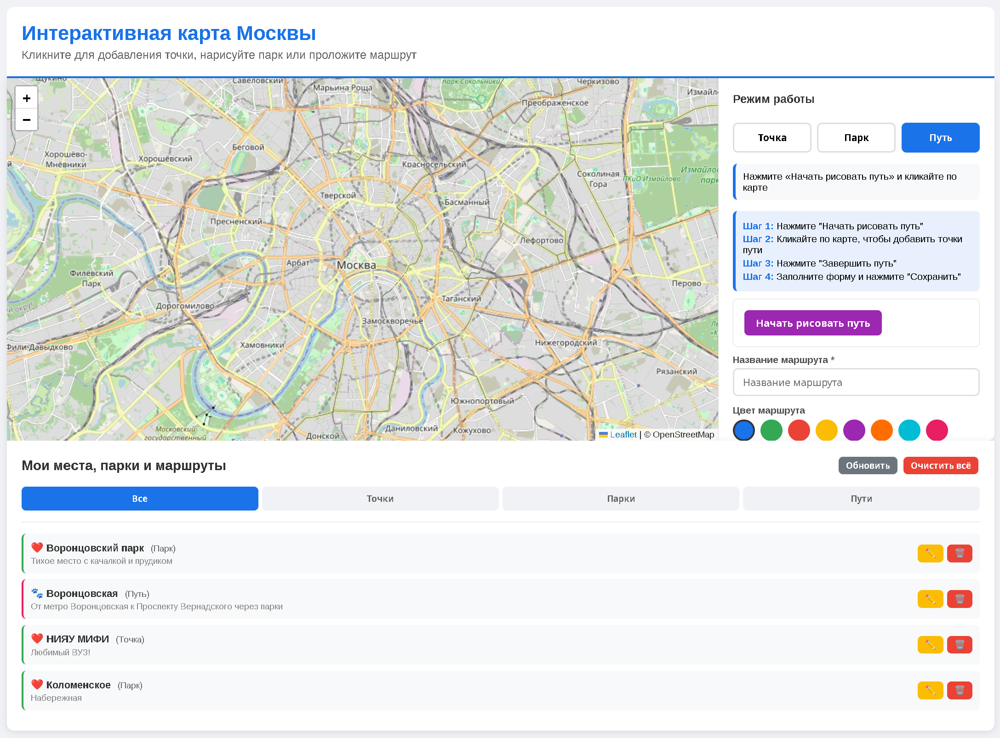

# Интерактивная карта Москвы

Веб-приложение для создания интерактивной карты Москвы с возможностью отмечать места, парки и прокладывать маршруты. Идеально подходит для планирования прогулок, ведения дневника путешествий и визуализации впечатлений о городе.



## Особенности

- **Точки** - отмечайте любые места на карте
- **Парки** - выделяйте области (парки, районы)
- **Маршруты** - прокладывайте пути с выбором цвета
- **❤️ / 💩** - оценивайте места (нравится / не нравится)
- **Фото** - добавляйте изображения к местам и паркам
- **Комментарии** - оставляйте заметки
- **Список** - все объекты собраны в удобном списке
- **Редактирование** - изменяйте название, рейтинг, описание и фото
- **Удаление** - удаляйте ненужные объекты
- **Сохранение** - все данные хранятся в JSON-файлах

## Установка

**Клонируйте репозиторий**
```bash
git clone https://github.com/Olyastel/My_Moscow_itinerary